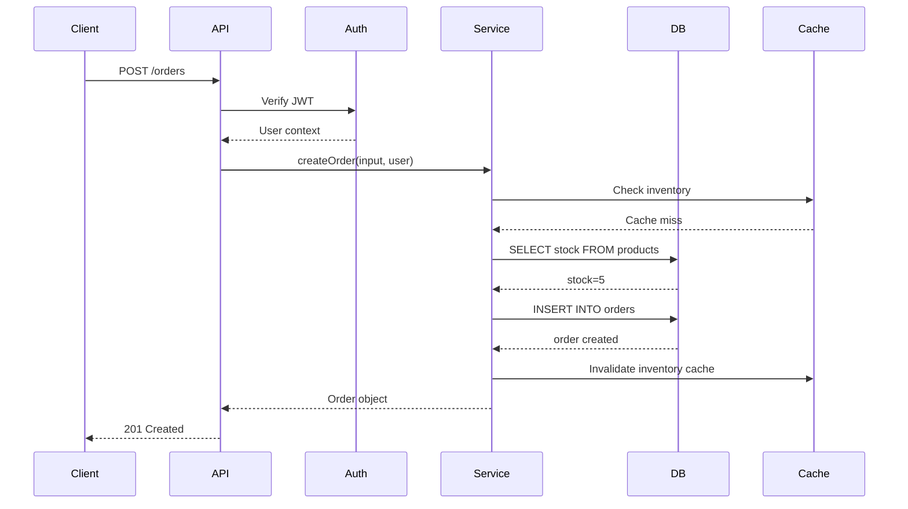
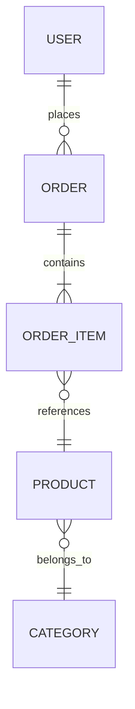
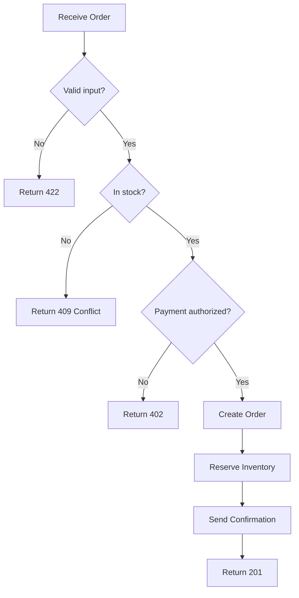
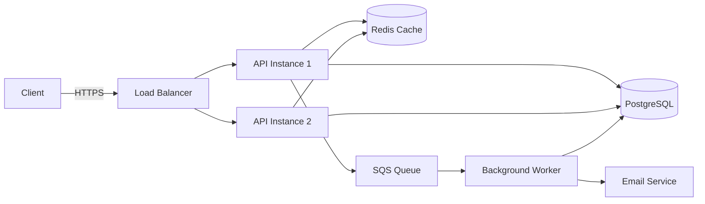

Explain backend code with visual diagrams, annotated code, and clear prose. Make the invisible visible.

## Discover

Trace the target thoroughly before explaining:

### For a specific endpoint
1. Find the route definition (path, method, middleware chain)
2. Trace through middleware: auth → validation → rate limiting → handler
3. Follow the handler into service/business logic layer
4. Track database queries: what tables, what joins, what indexes
5. Identify side effects: emails sent, events published, cache updated, logs written
6. Map the error paths: what can fail, how each failure is handled
7. Note the response transformation: domain object → DTO → HTTP response

### For a module/service
1. Identify the public interface (exported functions/classes)
2. Map dependencies (what it imports, what it calls)
3. Understand the data flow through the module
4. Find all callers (who depends on this module)
5. Identify state management (database tables, cache keys, queue topics)

### For the full project ("overview")
1. Map all entry points (HTTP routes, queue consumers, cron jobs, webhooks)
2. Identify the main layers (routes → middleware → services → data access)
3. Map external dependencies (databases, caches, queues, third-party APIs)
4. Understand the deployment topology (single service? microservices? serverless?)
5. Identify cross-cutting concerns (auth, logging, error handling)

## Diagram

Generate appropriate Mermaid diagrams based on what's being explained:

### Request Flow → Sequence Diagram


### Data Model → Entity-Relationship Diagram


### Business Logic → Flowchart


### System Architecture → Component Diagram


### Choose diagrams based on context:
- **Endpoint trace**: sequence diagram showing the full request lifecycle
- **Data relationships**: ER diagram of relevant tables
- **Business logic with branches**: flowchart
- **System overview**: architecture/component diagram
- **State machine**: state diagram for entities with lifecycle (order: pending → paid → shipped → delivered)

## Annotate

Show key code snippets with explanatory comments focused on **why**, not what:

```typescript
// This middleware runs BEFORE route handlers.
// Order matters: auth first, then validation, then the handler.
// If auth fails, we never reach validation (short-circuit).
app.use('/orders', authMiddleware, validateBody(createOrderSchema), orderHandler)

// We use optimistic locking here because two users might try to
// buy the last item simultaneously. The version check prevents
// one from overwriting the other's purchase.
await db.query(
  'UPDATE products SET stock = stock - 1, version = version + 1 WHERE id = $1 AND version = $2',
  [productId, expectedVersion]
)
```

Focus annotations on:
- Non-obvious decisions ("why this approach over the alternative")
- Implicit behavior (middleware order, ORM magic, framework conventions)
- Gotchas ("this looks wrong but it's intentional because...")
- Performance considerations ("we cache this because the DB query is expensive")

## Summarize

Provide a plain-language summary covering:

1. **What it does**: one paragraph explaining the purpose
2. **How data flows**: from input to output, through which layers
3. **Where side effects happen**: database writes, cache updates, events published, emails sent
4. **What can go wrong**: failure modes and how they're handled
5. **Key design decisions**: why this architecture, what tradeoffs were made
6. **Gotchas**: things that might surprise a new developer

## Adjust Depth

Based on the target scope:

- **Single endpoint**: Full sequence diagram, annotated code, all error paths
- **Module deep-dive**: Interface diagram, data flow, dependency map, key code paths
- **Project overview**: Architecture diagram, layer description, entry points, key patterns
- **Concept** (e.g., "how auth works"): Cross-cutting view across relevant files, flow diagram

## Anti-Patterns to Avoid

- Explaining what the code literally does line-by-line (the reader can read code)
- Diagrams that are so detailed they're unreadable (simplify, focus on the important parts)
- Missing the "why" — the most valuable thing to explain is the reasoning, not the syntax
- Assuming knowledge that a new team member wouldn't have
- Skipping error paths (these are often the most confusing parts)
